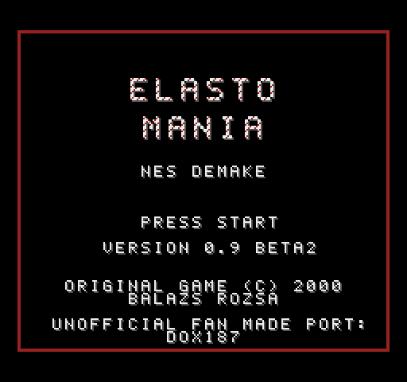
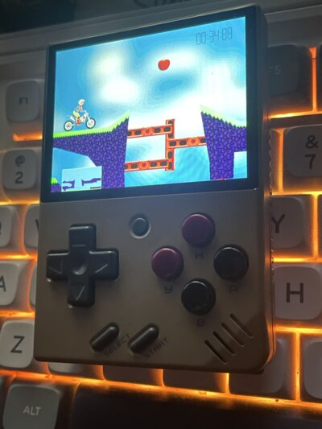

# Game release
This is NOT a playable release of Elasto Mania. If you're looking to play any of the Elasto Mania games, visit https://elastomania.com.

# Elasto Mania (2000) Source Code
This repository was uploaded in good faith for the purpose of exploring the original source code of this classic game. Non-source-code game assets (sounds, graphics, tools, etc.) are not part of this open source release.

See [LICENSE.md](LICENSE.md) for license information.

If you'd like to use this source code in ways other than permitted by the license and this document, contact us at info@elastomania.com.

If you'd like to support continued development of the Elasto Mania franchise, you can do so by buying our games on any store front linked on our website.

*The Elasto Mania Team*

https://elastomania.com

---

# Elma Ports

Ports of the original game for desktops and Linux handhelds, plus separate
NES and SNES versions. Each platform's README covers requirements, building
and use.

## Console ports

### NES demake

A separate NES program with the internal levels converted into cartridge
data and the physics rewritten in 6502 assembly. It saves best times in
battery-backed RAM and builds NTSC, PAL and shareware ROMs. Tested in
emulators only.

  
  

[Requirements, build and controls →](console/nes/README.md)

### SNES demake

A separate SNES program made to look and play like the PC original: the
internal levels with their ground, grass, sky and pictures, the bike and the
objects drawn from the pictures of the game's LGR file, and the menus, best
times and sounds of the original. The physics is rewritten in fixed point
and 65816 assembly. Every ROM is built from the files of your own copy of
the game, the shareware, the registered or the Steam release. Tested in
emulators only. It does not give the experience of playing the original
game and may have bugs.

  
  

[Requirements, build and controls →](console/snes/README.md)

## Handheld Linux devices

The SDL backend with gamepad controls and packages for PortMaster handhelds
(SDL2) and the Miyoo Mini / Mini Plus with Onion OS or MinUI (SDL 1.2).
The Miyoo Mini build has been tested on Onion OS 4.3; PortMaster has only
been tested in emulation, and MinUI has not been tested on a device yet.
The level editor is omitted.

  

Elasto Mania on a Miyoo Mini v2.

[Requirements, build, installation and controls →](handheld/README.md)

## Desktop ports

### Native Linux and macOS ports

The original game and physics with native SDL2 video, input and sound.
Supports wide screens, scaling and zoom, the level editor, existing players
and best times, and registered Steam game data. The Linux port builds on
the native Apple Silicon macOS backend.

[Linux build →](desktop/F_SDL/README.md#native-linux-port) ·
[macOS build →](desktop/F_SDL/README.md#native-macos-port) ·
[Game data and settings →](desktop/F_SDL/README.md#game-data-and-running)

### Terminal version (elma-cli)

The same game and physics rendered as half blocks, Braille dots or ASCII,
with text menus and optional SDL2 sound. Requires a terminal supporting the
kitty keyboard protocol. Tested on Linux in Ghostty; macOS is untested.
The level editor is omitted.

[Requirements, build and use →](desktop/F_CLI/README.md)

## Source layout

| Directory | Content |
|-----------|---------|
| [`src`](src) | Game and physics code shared by desktop and handheld versions |
| [`desktop/F_SDL`](desktop/F_SDL/README.md) | SDL backend for Linux, macOS and handhelds; shared display settings and port fixes |
| [`desktop/F_CLI`](desktop/F_CLI/README.md) | Terminal display and input |
| [`desktop/F_WIN`](desktop/F_WIN) | Original Windows DirectX layer, not built |
| [`handheld`](handheld/README.md) | Toolchains, launchers and package build script |
| [`console/nes`](console/nes/README.md) | NES demake, a separate program |
| [`console/snes`](console/snes/README.md) | SNES demake, a separate program |
| [`third_party/hqx`](third_party/hqx/README.md) | Pixel art scalers and their license |

[`CMakeLists.txt`](CMakeLists.txt) in the root builds the code in `src` with a
platform layer from `desktop`. The NES and SNES versions have their own
Makefiles.

## Credits

The macOS version and the SDL port that the other ports build on were taken
from the code of [x0o1y](https://github.com/x0o1y/elma) (commit
[`d2280c7`](https://github.com/x0o1y/elma/commit/d2280c7337f0953ab39549561299101a411c067a),
*Add native Apple Silicon macOS port*).

The pictures of a zoomed level are enlarged with the
[hqx](https://github.com/grom358/hqx) scalers (GNU LGPL 2.1, in
[`third_party/hqx`](third_party/hqx/README.md)).
