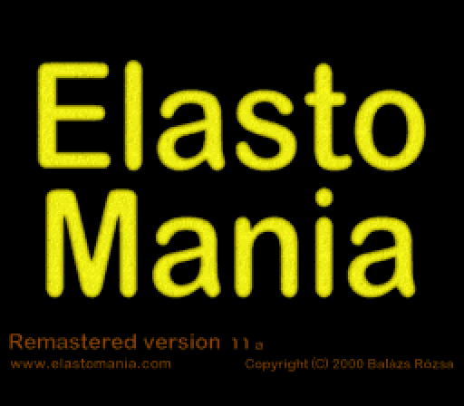
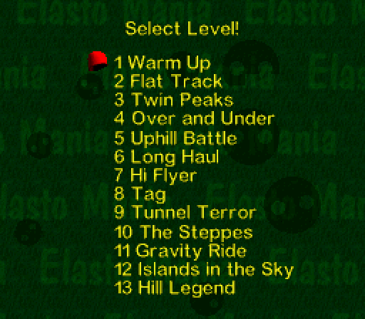
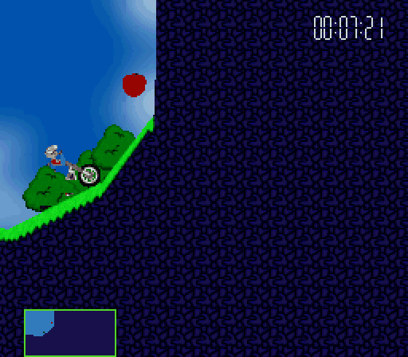

# Elasto Mania SNES demake

Current version: **0.1 alpha** (kept in [`VERSION`](VERSION)).

An unofficial, fan-made version of Elasto Mania for the Super Nintendo,
made to look and play like the PC original. It is a separate program, not a
port of the game's code: the levels, pictures, fonts and sounds of the game
are converted from your own copy, and the physics of the game (`LEPTET.CPP`,
`BEALLIT.CPP`, `UTKOZES.CPP`) is rewritten in fixed point and 65816
assembly.

- The internal levels of the game, unlocked one by one as in the original,
  with their ground, grass, sky and pictures, the apples, flowers and
  killers, the time and the view box.
- The bike and the rider are drawn from the pictures of the LGR file, as
  the original draws them, at 0.4 of their size: the SNES shows the same
  part of the level on its 256 pixels as the original on 640.
- The menus of the original with its fonts and background: players, the
  levels finished, the best ten times of each level, Options (Sound,
  Animated Menus, Video Detail, Animated Objects, Customize Controls) and
  Help. They are saved in the battery-backed RAM of the cartridge.
- The engine, friction and effect sounds of the original, mixed on the
  sound processor as the original's mixer does.
- Not included: the level editor, external levels, replays, the demo and
  two players.

<p>
  
  
  
</p>

The intro and the main menu, the list of the levels and a part of a ride on
Warm Up (the apple, and a turn), recorded from the NTSC ROM in an emulator,
built from the `elma.res` of the Steam release and the LGR file of 1.11a.

The ROM is a LoROM cartridge with FastROM, 4 MB of ROM and 8 KB of
battery-backed RAM. It has been tested in emulators only (Mesen 2 and
snes9x).

## Known issues

This version does not give the experience of playing the original game, and
it may have bugs.

- When the bike moves fast, the edges of the level that come onto the
  screen (the ground against the air, the grass and the pictures) are drawn
  late: for a moment they show the plain texture of the ground or the air,
  until the console catches up. The console makes these parts of the
  picture while the level scrolls, in the time that the physics leaves of a
  frame.

## Physics

The physics runs 80 steps a second, as close to the original's 0.0055 game
time units a step as the console allows (the original's physics becomes
unstable with steps of 60 a second). `test/phys_spec.c` describes it in C;
the assembly follows it to the bit. Compared with the original's physics on
the same keys, the bike stays within 1 cm of the original's for at least
2 seconds in 96 % of the test runs, and every run that ends (the flower, a
crash) ends the same way in the same step. Over longer rides the two drift
apart, as the original itself does with a different frame rate.

## Speed

A step of the physics takes about 100,000 master clocks of the console
(28 % of an NTSC frame), the background, the bike, the objects, the time
and the sound about 80,000 a frame together. When the console cannot draw a
frame in time it shows the previous one again and makes up the steps of the
physics in the next, so the game keeps its speed: on Warm Up about 15 % of
the frames are shown twice while riding.

## Build

Requirements:

- [PVSnesLib](https://github.com/alekmaul/pvsneslib) 4.6, found through
  `PVSNESLIB_HOME` or in `~/pvsneslib`, `~/.local/share/pvsneslib`;
- GNU Make 4.3 or newer;
- Python 3 with numpy and Pillow;
- `elma.res` and an LGR file from a legally obtained copy of the game, both
  of them: `elma.res` has the levels, the fonts and pictures of the menus
  and the sounds, the LGR file the bike, the rider, the objects, the
  textures, the grass and the pictures of the levels.

The game's files are copyrighted: they are not part of this repository and
neither is anything made from them. Everyone builds the ROM from their own
copy of the game, and the ROMs must not be shared. These copies work:

| Game | `ELMA_RES` | `ELMA_LGR` |
|------|------------|------------|
| Steam release | `base/elma.res` | `base/lgr/default.lgr` (the remastered pictures) or `base/lgr/orig.lgr` (those of the original) |
| Registered 1.11a | `Elma.res` | `Lgr/Default.lgr` |
| Shareware 1.1 or 1.11a | `elma.res` | `lgr/default.lgr` |

```sh
cd console/snes
make ELMA_RES=/path/to/elma.res ELMA_LGR=/path/to/default.lgr
```

Without `ELMA_RES` the build uses `../../elma.res`, the `elma.res` in the
root of the repository; without `ELMA_LGR` it looks for `lgr/default.lgr`
next to `elma.res`, in any case of letters. `make clean` removes `build/`
with the ROMs and everything generated from the game.

A ROM is written for each TV system, `build/elma_ntsc.sfc` and
`build/elma_pal.sfc`, or `build/elma_sw_ntsc.sfc` and `build/elma_sw_pal.sfc`
from the shareware game (its 18 levels and Please Register, the level after
them). The program is the same, only
the region in the header differs; on a PAL console the game keeps its speed.
Options:

- `TV=ntsc` or `TV=pal`: only the ROM for one TV system.
- `PHYS_HZ=80`: steps of the physics a second (see above).

## Controls

The buttons of a level can be changed in Options, Customize Controls, as in
the original; these are the buttons at the start:

| Button            | In a level                         |
|-------------------|------------------------------------|
| B                 | Gas (Throttle)                     |
| A                 | Brake                              |
| Left, Right       | Volt (Rotate left, right)          |
| X                 | Turn around (Change direction)     |
| Select            | View box on and off                |
| L                 | Time on and off                    |
| Start             | Leave the level (the original's Esc, cannot be changed) |

As in the original, there is no pause: leaving a level shows the menu
after it, as a crash does.

In the menus Up and Down move, L and R turn a page, A or Start chooses and
B goes back. A name is entered with Up and Down changing the last letter,
Right adding a letter and Left removing one.

## Tests

The tests run the ROMs in the test runner of
[Mesen 2](https://github.com/SourMesen/Mesen2) (`test/mesen.py`, without a
window); the physics checks also need a C and a C++ compiler for the host.

| Command | What it checks |
|---------|----------------|
| `make phys-check` | the physics in C against the original's, and the assembly against the C to the bit, with its time a step (its cases need the levels of the registered game) |
| `make tests` | builds the test ROMs of the parts below |
| `test/play.py` | plays a level with the keys of the original from its first frame, or with the keys of each step of the physics (`--steps`) |
| `test/finish_test.py` | finishes Warm Up with the keys of the steps found by `test/finish_search.py` (on the host, with the physics in C; `make build/host/physplay.so`), to the hundredth of the time it predicts |
| `test/map_check.py` | the background of the levels in the video memory against the converted data |
| `test/bike_test.py` | the sprites of the bike against a model of the original's drawing |
| `test/hud_check.py` | the time and the view box against a model of the original's |
| `test/ui_test.py` | the menus, the players and the best times in the SRAM |
| `test/snd_compare.py` | the sounds against a model of the original's mixer |

## Sources

| File                  | Content                                              |
|-----------------------|------------------------------------------------------|
| `src/core.asm`        | The frame loop: the NMI, the queue of transfers, the joypad |
| `src/main.c`, `src/game.c` | The menus and the levels after each other; playing a level |
| `src/phys.asm`        | The physics and the objects in 65816 assembly        |
| `src/map.asm`         | The ground, grass, pictures and sky, loaded as the camera moves |
| `src/bike.asm`, `src/objects.asm` | The bike, the rider and the objects as sprites |
| `src/hud.asm`         | The time and the view box                            |
| `src/ui*.c`, `src/save.c` | The intro, the menus and the saved state        |
| `src/snd.asm`, `spc/driver.asm` | The sound on the 65816 and on the sound processor |
| `tools/gen_*.py`      | The converters of the game's data                    |
| `test/phys_spec.c`    | The physics in C: the description of the assembly    |

The original game is © 2000 Balázs Rózsa. This version is not affiliated
with or endorsed by its authors.
