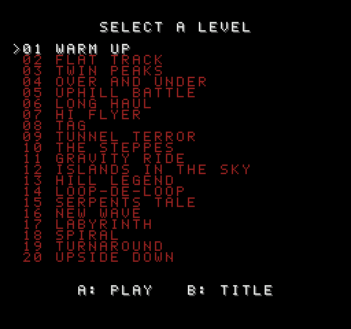
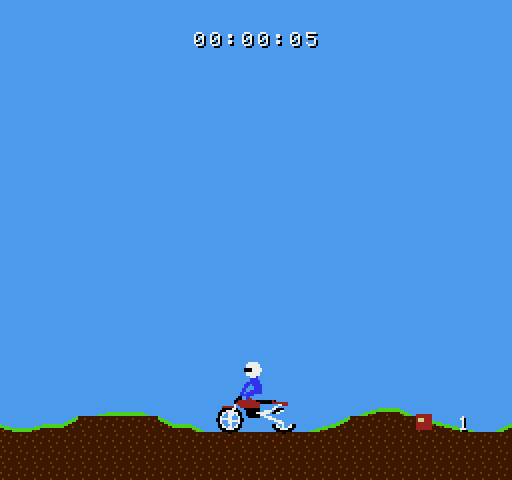
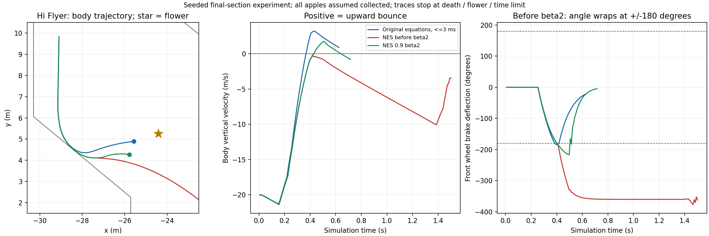

# Elasto Mania NES demake

Current version: **0.9 beta2**. The release version is kept in [`VERSION`](VERSION)
and displayed on the title screen of every NTSC, PAL and shareware build.

An unofficial, fan-made version of Elasto Mania for the Nintendo
Entertainment System. It is a separate program, not a port of the game's
code: the levels of the game are converted into NES graphics and data, and
the physics of the game (`LEPTET.CPP`, `BEALLIT.CPP`) is rewritten in fixed
point and 6502 assembly.

- The 54 internal levels, unlocked one by one; the best time of each level
  is saved in the battery-backed RAM of the cartridge.
- The bike, the rider and the objects are sprites drawn for the NES; the
  ground and the sky of each level are background tiles.
- Not included: the level editor, replays, two players and the LGR
  graphics of the game.

<p>
  
  
  
</p>

The title screen, the list of the levels and a ride on Warm Up that ends
on the rider's head, recorded from the NTSC ROM in an emulator.

The ROM is an MMC3 cartridge (mapper 4) with 512 KB PRG-ROM, 256 KB
CHR-ROM and 8 KB of battery-backed PRG-RAM; the shareware version (see
below) has 128 KB of each ROM. It has been tested in emulators only.

## Speed

In emulator tests with the default settings, NTSC managed about 45–49
physics updates per second and PAL about 43–47, instead of the intended 50.
When the console cannot keep up, the game slows down, with PAL slowing
down a little more often than NTSC.

## Build

Requirements:

- the [llvm-mos SDK](https://github.com/llvm-mos/llvm-mos-sdk), with
  `mos-nes-mmc3-clang` in the `PATH`, in `~/.local/share/llvm-mos` or given
  as `LLVM_MOS=/path/to/llvm-mos`;
- GNU Make 4.3 or newer (the Makefile uses grouped targets; the make 3.81
  that comes with macOS is too old, `gmake` from Homebrew works);
- Python 3 with numpy and Pillow;
- `elma.res` from a legally obtained copy of the game, registered or
  shareware (see below).

```sh
cd nes
make ELMA_RES=/path/to/elma.res
```

Without `ELMA_RES` the build uses `../elma.res`, the `elma.res` in the root
of the repository, so there a plain `make` is enough. `make clean` removes
`build/` with the ROMs and everything generated.

A ROM is written for each TV system, `build/elma_ntsc.nes` and
`build/elma_pal.nes`, or `build/elma_sw_ntsc.nes` and
`build/elma_sw_pal.nes` from the `elma.res` of the shareware game (see
below). The PAL ROM counts 50 frames a second, tunes its sounds to the
clock of a PAL NES and says PAL in its header. Options:

- `TV=ntsc` or `TV=pal`: only the ROM for one TV system.
- `PHYS_HZ=50` or `60`: steps of the physics a second (see above).
- `LEVELS="a.lev b.lev"`: level files added after the internal levels. The
  cartridge has room for little more than the internal levels.

### Shareware version

The `elma.res` of the shareware game, which was free to share, builds the
shareware version of the ROMs, `build/elma_sw_ntsc.nes` and
`build/elma_sw_pal.nes`: the first 10 levels, with "SHAREWARE VERSION" on
the title screen, on a smaller cartridge of 128 KB PRG-ROM and 128 KB
CHR-ROM. The build tells the data apart by the table of the files in
`elma.res`, which the shareware game encrypts with another key.

Only the `elma.res` of the shareware version 1.1 is supported: 995,516
bytes, SHA-256
`f25c0f8ff5f51e8b7b3ad0284eed275a9213d35cedee1787f1c60906dfb22e2b`. The
same file comes with the Windows installer of the shareware version 1.11a
and with the shareware version 1.1 for BeOS.

## Controls

| Button            | In the game                        |
|-------------------|------------------------------------|
| A                 | Gas                                |
| B                 | Brake                              |
| Left, Right       | Volt                               |
| Up                | Turn around                        |
| Select            | Pause, with the sound              |
| Start             | Play the level again               |
| Start twice       | Back to the list of the levels     |

Start pressed again within half a second of letting it go, with no other
button in between, goes back to the list.

After the bike died, A or B plays the level again and Start goes back to
the list, as the lines under the message say.

In the list of the levels Up and Down choose a level, Left and Right turn a
page, A plays it and B goes back to the title.

## Tests

`make check ELMA_RES=/path/to/elma.res` runs the fixed point physics next to
the game's physics on the first level, checks that `physics.S` gives the
same bike as `physics.c` to the bit in the simulator of the SDK, and prints
the cycles of a step. Besides the SDK it needs a C compiler for the host,
`cc` or the one given as `HOSTCC=`.

`test/run.py` plays the ROM in the [cynes](https://github.com/Youlixx/cynes)
emulator with a script of buttons and saves screenshots.

`python3 test/hyflyer.py --res /path/to/elma.res --asm --scan` runs the
Hi Flyer regression below (numpy, matplotlib and a host C compiler;
`--asm` also needs the SDK). CSV traces, measurements and the plot are
written to `build/hyflyer-check`. `--tv pal` and `--hz 60` select other
physics constants. The optional parameter scan is not a player success rate.

## Hi Flyer brake bounce — fixed in 0.9 beta2

At the end of Hi Flyer, braking after dropping down the pipe could fail
to bounce the bike back up to the flower. During a hard landing, a number
in the brake calculation could wrap around, making the brake push in the
wrong direction.

**0.9 beta2 fixes this calculation in both physics implementations.**
The bike now makes the bounce and reaches the flower in the targeted
tests of this section, though some differences from the original physics
remain.



## Sources

| File                  | Content                                              |
|-----------------------|------------------------------------------------------|
| `src/physics.c`       | The physics in C: the description of the assembly    |
| `src/physics.S`       | The physics in 6502 assembly, in a bank of its own   |
| `src/mul.s`           | Multiplication with tables of quarter squares        |
| `src/game.c`          | Playing a level: steps, objects, drawing             |
| `src/map.c`           | The map in the nametables, loaded as it scrolls      |
| `src/segs.c`          | The lines of the ground for the physics, by cells    |
| `src/menu.c`          | The title, the list of the levels and the results    |
| `tools/build.py`      | Converts the levels and makes the graphics and data  |
| `tools/physconst.py`  | The constants of the physics                         |
| `test/refphys.c`      | The game's physics in double precision, for the tests |

The original game is © 2000 Balázs Rózsa. This version is not affiliated
with or endorsed by its authors.
